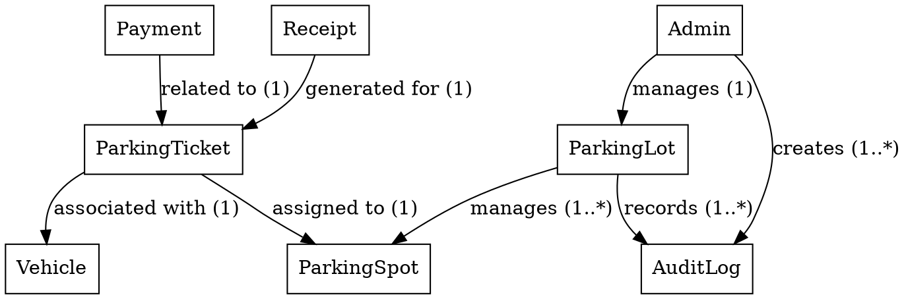
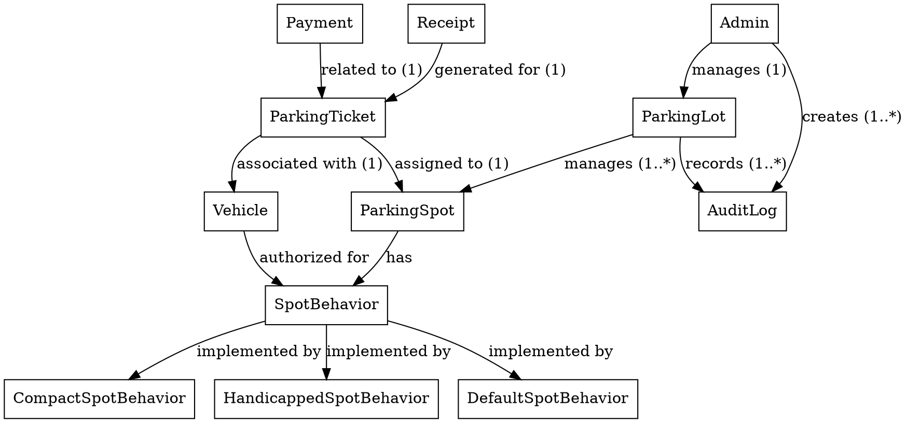
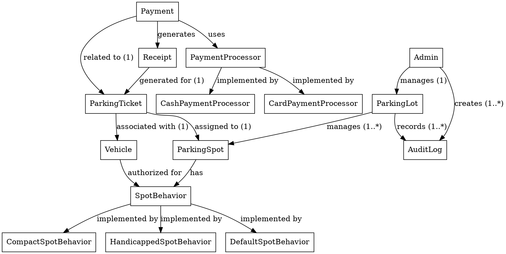
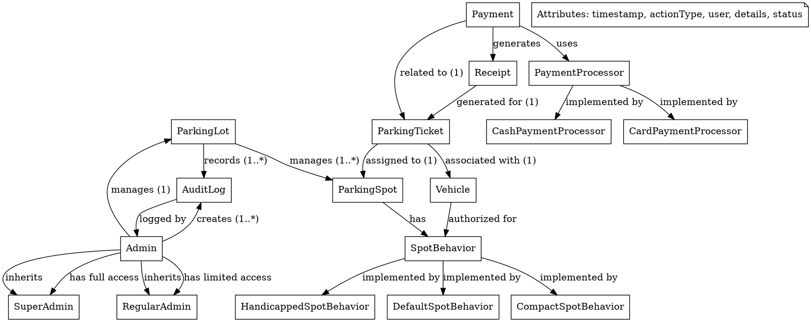
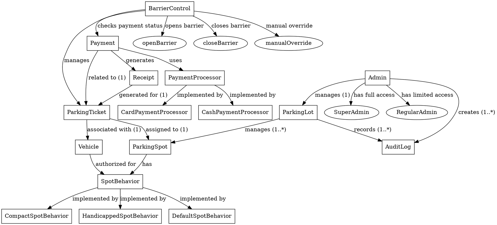

I want you to design a Parking Lot System. Could you start by suggesting some features that we should support in our design?

ChatGPT:

For a Parking Lot System, the design should support features that manage parking spaces efficiently while providing a seamless user experience. Here are some key features that can be included in the system:

1. **Parking Space Management:**

- Track available and occupied parking spots.

- Different types of parking spaces (e.g., compact, standard, oversized, handicapped).

- Reserve a parking spot in advance (optional).

2. **Vehicle Registration:**

- Register vehicles based on license plate or vehicle ID.

- Support for different types of vehicles (e.g., cars, motorcycles, electric vehicles).

3. **Entry and Exit Management:**

- Entry and exit gates for vehicles.

- Record the time of entry and exit for calculating parking fees.

- Automatic license plate recognition (optional).

4. **Fee Calculation:**

- Calculate parking fees based on time spent or flat rates (hourly, daily, monthly).

- Support different rates for different types of vehicles or parking spaces.

- Payment integration (e.g., cash, card, mobile payment).

5. **Parking History:**

- Maintain a log of vehicles entering and exiting the parking lot.

- Store parking history for users to view past parking sessions.

6. **Parking Spot Availability Alerts:**

- Real-time updates on parking spot availability.

- Alert users when there are available spots in the lot (optional for app-based systems).

7. **Parking Lot Capacity Management:**

- Monitor the total capacity of the parking lot.

- Prevent entry when the lot is full or overcapacity.

8. **User Accounts and Preferences:**

- Support user accounts for recurring customers.

- Allow users to manage their preferences (e.g., preferred parking spots, vehicle types).

9. **Notifications:**

- Notify users when their parking session is about to expire.

- Alert users about any changes in parking lot status or availability.

10. **Admin Features:**

- Admin interface to manage parking lot capacity, fees, and users.

- Report generation for tracking revenue, parking usage, and violations.

- Monitor system health and security alerts.

11. **Parking Lot Access Control:**

- Different access levels for users, staff, and admins.

- Support for gate access control (e.g., QR code scanning, RFID).

12. **Support for Special Vehicles:**

- Reserved spots for electric vehicles with charging stations.

- Special spots for oversized vehicles or VIP users.

These features can be prioritized and expanded based on the specific needs and use cases of the parking lot system. What additional features or constraints would you like to explore?

You:

You've provided a comprehensive list of features! Let's focus on the core functionalities for this interview to keep the scope manageable. I'll keep the basic parking management, vehicle handling, payment processing, and admin operations. We'll keep out some advanced features like automatic license plate recognition, mobile notifications, real-time alerts, and reservation systems to keep our design focused.

Now that we have our core features defined, do you have any clarifying questions about these requirements? For example, about how the parking spots are assigned, payment processing, or any other aspect of the core features we're supporting?

ChatGPT:

To ensure the design aligns with the core functionalities, here are some clarifying questions to refine the requirements:

### Parking Management:

1. **Spot Assignment:**

- How are parking spots assigned to vehicles? Should the system automatically allocate the first available spot, or is there a specific logic (e.g., nearest to entry)?

- Are different types of spots (compact, standard, handicapped) involved, and if so, how should the system prioritize assignment?

- Should vehicles of different types be limited to specific spot types?

2. **Capacity Handling:**

- What should happen if the parking lot is full? Should we maintain a waitlist or simply reject entry?

- Should the system account for spots temporarily unavailable due to maintenance or other issues?

### Vehicle Handling:

1. **Vehicle Information:**

- What vehicle details need to be recorded (e.g., license plate, type, owner name)?

- Will the system support multiple vehicles under one user account?

2. **Time Tracking:**

- Should time tracking begin at the entry gate or when the vehicle is assigned a spot?

### Payment Processing:

1. **Fee Calculation:**

- Should the system charge hourly, daily, or flat fees? If hourly, should there be rounding (e.g., charge for a full hour after 30 minutes)?

- Will there be different rates for vehicle types or parking spot types?

2. **Payment Methods:**

- Should the system support cash and card payments only, or do you want to include an option for online payments (e.g., through a user portal)?

- How should payment confirmation and receipts be handled (e.g., printed at exit, emailed)?

3. **Pre-Payment or Post-Payment:**

- Should users pay when exiting (post-payment), or is pre-payment required upon entry?

### Admin Operations:

1. **Admin Controls:**

- What actions can administrators perform? For example, manually assign spots, adjust fees, or view usage and revenue reports?

- Should administrators be able to override spot assignments or force vehicle exits?

2. **Audit Logs:**

- Should the system maintain logs of all entries, exits, payments, and admin actions for auditing purposes?

These questions help narrow the scope while covering edge cases and clarifying expectations. Let me know if additional areas should be explored!

You:

For Parking Management:

Spots will be automatically assigned on first-come-first-serve basis, picking the first available spot
Vehicle types will be restricted to appropriate spot types (e. g. , compact cars can't park in motorcycle spots)
When lot is full, we'll simply reject new entries
We'll support marking spots as unavailable for maintenance
For Vehicle Handling:

We'll store basic vehicle info: license plate, vehicle type, and owner details
For this design, let's keep it simple with one vehicle per ticket/transaction
For Time Tracking:

Time tracking starts when vehicle enters through the gate
For Payment:

Hourly rate with rounding up to the next hour
Different rates for different vehicle types
Support for both cash and card payments at exit
Payment will be post-payment (at exit)
System will generate a basic receipt at payment
For Admin Operations:

Admins can view occupancy, modify rates, mark spots for maintenance
System will maintain basic audit logs for entries, exits, and payments
Do you have any other specific questions about these aspects before we move to the class diagram phase?

ChatGPT:

The outlined requirements provide a clear scope for the system design. Before moving to the class diagram phase, here are some additional clarifying questions to address any potential gaps or ambiguities:

### Parking Management:

1. **Spot Prioritization:**

- Should specific types of spots (e.g., handicapped) be prioritized or reserved for certain users, even if they are available?

2. **Spot Maintenance:**

- How should the system handle vehicles already parked in spots marked for maintenance? Should administrators manually move them, or is a warning sufficient?

### Payment:

1. **Hourly Rate Calculation:**

- If a user parks for less than an hour, should the system charge for a full hour, or is there a grace period (e.g., first 15 minutes free)?

2. **Receipt Content:**

- What information should be included on the receipt (e.g., entry time, exit time, parking duration, fee breakdown)?

### Admin Operations:

1. **Role Differentiation:**

- Will all admins have the same level of access, or should there be different admin roles (e.g., super admin vs. maintenance admin)?

2. **Audit Logs:**

- How long should audit logs be retained? Should they include only high-level details or comprehensive records of all transactions and changes?

### System Behavior:

1. **Error Handling:**

- How should the system handle situations like failed card transactions or admin errors when marking spots for maintenance?

2. **Exit Without Payment:**

- What should happen if a vehicle tries to exit without successful payment (e.g., barrier remains down, manual intervention required)?

### Future Proofing:

1. **Scalability:**

- Should the design assume a single parking lot, or should it allow for expansion to multiple lots with centralized management in the future?

If the above aspects are clear, the design can proceed confidently to the class diagram phase! Let me know if anything stands out for further refinement.

You:

For spots and maintenance:

Handicapped spots will be reserved strictly for authorized vehicles
For maintenance, admin will need to wait for spot to be vacant before marking it for maintenance
For payment and receipts:

We'll implement a 15-minute grace period, after which full hour charge applies
Receipts will include: Entry time, exit time, duration, base rate, total amount, and payment method
For admin and audit:

We'll have two roles: Super Admin (full access) and Regular Admin (basic operations)
Audit logs will be retained for 3 months with comprehensive transaction details
For error handling:

Failed payments will require retry or alternative payment method
Exit barrier will remain closed until successful payment
Manual override available for admin in case of system issues
I think we have covered all the essential aspects of the system now. Should we proceed to the class diagram phase where you can start designing the classes that will implement these requirements?

ChatGPT:

The requirements are well-defined, and the outlined constraints provide a clear framework for designing the system. Let’s proceed to the **class diagram phase** . Here's the proposed plan for structuring the core components:

### Core Classes:

1. **ParkingSpot** :

- Attributes: `id`, `type`, `status` (available, occupied, maintenance), `isReserved`

- Methods: `markForMaintenance()`, `assignVehicle()`, `freeSpot()`

2. **Vehicle** :

- Attributes: `licensePlate`, `type`, `ownerDetails`

- Methods: None (used for data encapsulation)

3. **ParkingTicket** :

- Attributes: `ticketId`, `vehicle`, `spot`, `entryTime`, `exitTime`, `paymentStatus`

- Methods: `calculateDuration()`, `calculateFee()`, `closeTicket()`

4. **Payment** :

- Attributes: `paymentId`, `ticket`, `amount`, `paymentMethod` (cash/card), `timestamp`

- Methods: `processPayment()`, `generateReceipt()`

5. **Receipt** :

- Attributes: `receiptId`, `ticket`, `entryTime`, `exitTime`, `duration`, `amount`, `paymentMethod`

- Methods: None (acts as a data container)

6. **Admin** :

- Attributes: `adminId`, `name`, `role` (Super Admin, Regular Admin)

- Methods: `viewOccupancy()`, `modifyRates()`, `markSpotForMaintenance()`

7. **ParkingLot** :

- Attributes: `id`, `name`, `spots` (list of ParkingSpot), `currentRates` (map of vehicleType to rate)

- Methods: `getAvailableSpot(vehicleType)`, `releaseSpot(spotId)`, `addAuditLog()`

8. **AuditLog** :

- Attributes: `logId`, `action`, `timestamp`, `performedBy`

- Methods: None (acts as a log container)

9. **ErrorHandling** (optional utility class):

- Methods: `handlePaymentError()`, `handleSystemOverride()`

---

Would you like a graphical representation of this class diagram, or should we discuss additional details like relationships, methods, or edge case handling before visualizing it?

You:

Can you please start creating your class diagram on the screen on left? Consider the key entities and their relationships based on the requirements. Let me know when you are done with the initial design.

ChatGPT:

Analyzed

```python
from graphviz import Digraph

# Initialize a Graphviz Digraph
dot = Digraph(comment="Parking Lot System Class Diagram", format="png")
dot.attr(rankdir="LR", size="10,7")

# Define nodes (Classes)
classes = {
    "ParkingSpot": {
        "attributes": ["id", "type", "status", "isReserved"],
        "methods": ["markForMaintenance()", "assignVehicle()", "freeSpot()"]
    },
    "Vehicle": {
        "attributes": ["licensePlate", "type", "ownerDetails"],
        "methods": []
    },
    "ParkingTicket": {
        "attributes": ["ticketId", "vehicle", "spot", "entryTime", "exitTime", "paymentStatus"],
        "methods": ["calculateDuration()", "calculateFee()", "closeTicket()"]
    },
    "Payment": {
        "attributes": ["paymentId", "ticket", "amount", "paymentMethod", "timestamp"],
        "methods": ["processPayment()", "generateReceipt()"]
    },
    "Receipt": {
        "attributes": ["receiptId", "ticket", "entryTime", "exitTime", "duration", "amount", "paymentMethod"],
        "methods": []
    },
    "Admin": {
        "attributes": ["adminId", "name", "role"],
        "methods": ["viewOccupancy()", "modifyRates()", "markSpotForMaintenance()"]
    },
    "ParkingLot": {
        "attributes": ["id", "name", "spots", "currentRates"],
        "methods": ["getAvailableSpot(vehicleType)", "releaseSpot(spotId)", "addAuditLog()"]
    },
    "AuditLog": {
        "attributes": ["logId", "action", "timestamp", "performedBy"],
        "methods": []
    },
}

# Add class nodes to the graph
for class_name, details in classes.items():
    attributes = "\\l".join(details["attributes"])
    methods = "\\l".join(details["methods"])
    label = f"<<TABLE BORDER='0' CELLBORDER='1' CELLSPACING='0'>"
    label += f"<TR><TD BGCOLOR='lightblue'><B>{class_name}</B></TD></TR>"
    if attributes:
        label += f"<TR><TD ALIGN='LEFT'>{attributes}\\l</TD></TR>"
    if methods:
        label += f"<TR><TD ALIGN='LEFT'>{methods}\\l</TD></TR>"
    label += "</TABLE>>"
    dot.node(class_name, label=label, shape="plaintext")

# Define relationships (edges)
edges = [
    ("ParkingLot", "ParkingSpot", "1..*", "manages"),
    ("ParkingTicket", "Vehicle", "1", "associated with"),
    ("ParkingTicket", "ParkingSpot", "1", "assigned to"),
    ("Payment", "ParkingTicket", "1", "related to"),
    ("Receipt", "ParkingTicket", "1", "generated for"),
    ("Admin", "ParkingLot", "1", "manages"),
    ("AuditLog", "Admin", "1..*", "created by"),
    ("ParkingLot", "AuditLog", "1..*", "records")
]

# Add edges to the graph
for src, dest, cardinality, label in edges:
    dot.edge(src, dest, label=f"{label} ({cardinality})")

# Render the graph to file
output_path = "/mnt/data/ParkingLotClassDiagram"
dot.render(output_path, cleanup=True)
output_path
```

Result

```undefined
undefined
```

The initial design of the class diagram has been created. You can view or download the diagram [here]() . Let me know if there are any adjustments or additional relationships to consider! ​​

You:

give this in below format
digraph MessageArchitecture {
messageClient
messageQueue[shape=rarrow]
messageBackend[shape=rectanble]
messageDB[shape=cylinder]
userService[shape=rectangle]
userDB[shape=cylinder]
pushNotifications[shape=octagon]
messageNotifier[shape=rectangle]

messageClient -> messageBackend[label=sendMessage]
messageBackend -> userService
userService -> userDB
messageBackend -> messageDB
messageDB -> messageQueue[label="change data captrure"]
messageQueue -> messageNotifier
messageNotifier -> pushNotifications
}

ChatGPT:

Here's the class diagram in the requested format:



This representation follows your preferred notation and is concise for defining relationships between the system's entities. Let me know if you'd like any modifications!

You:

I can see you've created the basic structure. How would you handle different types of parking spots (standard, compact, handicapped) in your design? Would inheritance or composition be helpful here?

ChatGPT:

To handle different types of parking spots (e.g., standard, compact, handicapped) in the design, both **inheritance** and **composition** can be considered. Here’s how we can approach this:

### Option 1: Inheritance

Inheritance would be useful if parking spots of different types share common behavior but have distinct characteristics. We could have a base class `ParkingSpot` and subclasses for each specific spot type (e.g., `CompactSpot`, `StandardSpot`, `HandicappedSpot`). This approach allows us to define common behaviors in the parent class while letting subclasses specialize or override certain attributes and methods.

#### Benefits:

- **Polymorphism** : Allows the system to treat all spots as a generic `ParkingSpot` while still accommodating the specific behavior of each type.

- **Extensibility** : Easy to add more spot types (e.g., `ElectricSpot`) without changing the structure significantly.

#### Example:

```java
class ParkingSpot {
    protected String id;
    protected SpotType type;
    protected boolean isAvailable;

    public void markForMaintenance() {
        // Generic maintenance logic
    }

    public boolean assignVehicle(Vehicle vehicle) {
        // Common spot assignment logic
        return true;
    }

    public void freeSpot() {
        isAvailable = true;
    }
}

class CompactSpot extends ParkingSpot {
    public CompactSpot() {
        this.type = SpotType.COMPACT;
    }

    @Override
    public boolean assignVehicle(Vehicle vehicle) {
        if (vehicle.getType() == VehicleType.COMPACT) {
            return super.assignVehicle(vehicle);
        }
        return false; // Reject if vehicle type doesn't match
    }
}

class HandicappedSpot extends ParkingSpot {
    private boolean isReservedForAuthorized;

    public HandicappedSpot() {
        this.type = SpotType.HANDICAPPED;
        this.isReservedForAuthorized = true;
    }

    @Override
    public boolean assignVehicle(Vehicle vehicle) {
        if (isReservedForAuthorized && vehicle.isHandicapped()) {
            return super.assignVehicle(vehicle);
        }
        return false;
    }
}
```

### Option 2: Composition

In this approach, we could have a `ParkingSpot` class with a `SpotType` attribute, which determines whether the spot is a standard, compact, or handicapped spot. We could use composition to dynamically assign properties and behaviors based on the spot type.

#### Benefits:

- **Flexibility** : This approach allows more flexibility and decoupling because the `ParkingSpot` class doesn’t need to be subclassed for each spot type.

- **Easier to manage** : It may be easier to manage if the behavior of spot types doesn’t differ too drastically.

#### Example:

```java
class ParkingSpot {
    protected String id;
    protected SpotType type;
    protected boolean isAvailable;
    private SpotBehavior spotBehavior;

    public ParkingSpot(SpotType type) {
        this.type = type;
        this.spotBehavior = SpotBehaviorFactory.createSpotBehavior(type);
    }

    public boolean assignVehicle(Vehicle vehicle) {
        return spotBehavior.assign(vehicle);
    }

    public void markForMaintenance() {
        // Generic maintenance logic
    }

    public void freeSpot() {
        isAvailable = true;
    }
}

interface SpotBehavior {
    boolean assign(Vehicle vehicle);
}

class CompactSpotBehavior implements SpotBehavior {
    @Override
    public boolean assign(Vehicle vehicle) {
        return vehicle.getType() == VehicleType.COMPACT;
    }
}

class HandicappedSpotBehavior implements SpotBehavior {
    @Override
    public boolean assign(Vehicle vehicle) {
        return vehicle.isHandicapped();
    }
}

class SpotBehaviorFactory {
    public static SpotBehavior createSpotBehavior(SpotType type) {
        switch (type) {
            case COMPACT:
                return new CompactSpotBehavior();
            case HANDICAPPED:
                return new HandicappedSpotBehavior();
            default:
                return new DefaultSpotBehavior();
        }
    }
}
```

### Which Option to Choose?

- **Inheritance** is ideal if the behavior of different spot types varies significantly, and you need to ensure that each type has its specific logic. For example, the parking fee calculation could vary based on spot type, making inheritance a good fit.

- **Composition** is a better choice if the spot types share similar behaviors with only slight variations (such as the assignment rules) and you want to keep the design more flexible and decoupled. The **Strategy Pattern** (via the `SpotBehavior` interface) helps encapsulate the specific behavior for each type of spot and keeps the core logic of `ParkingSpot` generic.

### Recommendation:

In this case, since the behavior differences seem primarily related to how a vehicle is assigned to a spot (e.g., compact cars in compact spots, handicapped vehicles in handicapped spots), **composition** with a strategy-based approach (using the `SpotBehavior` interface) might be more flexible and easier to manage in the long term, especially as the system scales and new spot types are introduced.
Would you like to go ahead with the composition approach, or would you prefer inheritance?

You:

Could you modify your diagram to show this strategy pattern for spot types? Also, I notice the Vehicle class is empty - how would you handle different vehicle types and their authorization for handicapped spots?

digraph ParkingLotSystem {
ParkingLot[shape=rectangle]
ParkingSpot[shape=rectangle]
Vehicle[shape=rectangle]
ParkingTicket[shape=rectangle]
Payment[shape=rectangle]
Receipt[shape=rectangle]
Admin[shape=rectangle]
AuditLog[shape=rectangle]

ParkingLot -> ParkingSpot[label="manages (1..*)"]
ParkingTicket -> Vehicle[label="associated with (1)"]
ParkingTicket -> ParkingSpot[label="assigned to (1)"]
Payment -> ParkingTicket[label="related to (1)"]
Receipt -> ParkingTicket[label="generated for (1)"]
Admin -> ParkingLot[label="manages (1)"]
Admin -> AuditLog[label="creates (1..*)"]
ParkingLot -> AuditLog[label="records (1..*)"]
}

ChatGPT:

To incorporate the **Strategy Pattern** for handling different parking spot types and address the authorization of vehicles for handicapped spots, I'll modify the class diagram. Here's the updated version with these changes:

### Changes:

1. **Strategy Pattern** : The `ParkingSpot` class now has a `SpotBehavior` interface with specific behavior classes for different spot types like `CompactSpotBehavior`, `HandicappedSpotBehavior`, and a default behavior (`DefaultSpotBehavior`).

2. **Vehicle Class** : The `Vehicle` class now has attributes to represent different vehicle types (e.g., compact, standard, handicapped) and methods to check whether a vehicle is authorized to park in a handicapped spot.

Here's the updated diagram in the required format:



### Key Changes:

1. **Strategy Pattern** : `ParkingSpot` now has a dependency on `SpotBehavior`. `SpotBehavior` is an interface implemented by different concrete classes (`CompactSpotBehavior`, `HandicappedSpotBehavior`, and `DefaultSpotBehavior`), which define how a spot behaves when assigning vehicles to it.

2. **Vehicle Authorization** : The `Vehicle` class now has a relationship to `SpotBehavior`, representing which vehicle types are authorized for certain spot behaviors (e.g., handicapped spots can only be assigned to vehicles that are authorized for handicapped parking).

This structure keeps the system flexible and allows for easy extension when adding new vehicle types or spot types. Let me know if you'd like to modify or add any more details to the diagram!

You:

How would you handle the payment processing requirements? Could you add relevant classes for supporting both cash and card payments?

ChatGPT:

To handle the **payment processing** requirements, we can add classes that support both **cash** and **card** payments. We'll introduce a **PaymentProcessor** interface, which can have concrete implementations for **CashPaymentProcessor** and **CardPaymentProcessor** . Additionally, a **Payment** class will store the transaction details, and the **Receipt** class will be responsible for generating the payment receipt with relevant information.
Here's how we can modify the design to incorporate payment processing:

### Design Considerations:

1. **PaymentProcessor** : This will be the interface that defines the method `processPayment()`. The classes implementing this interface will define how cash or card payments are processed.

- **CashPaymentProcessor** : For cash payments, the payment processing would involve receiving cash and confirming the amount.

- **CardPaymentProcessor** : For card payments, we can simulate or integrate a payment gateway to handle the transaction.

2. **Payment** : This class will hold the details of the transaction, such as the amount, payment method, and the status of the payment.

3. **Receipt** : This class will generate a receipt once the payment is processed, including entry time, exit time, payment method, base rate, total amount, and other relevant details.

Let's update the class diagram to include these changes:



### Key Changes for Payment Processing:

1. **PaymentProcessor Interface** : This interface will have a method like `processPayment(double amount)` that each payment processor (cash and card) will implement.

2. **CashPaymentProcessor** : For cash payments, this class will handle transactions where the user provides cash. It could include details such as the amount received, change due, etc.

3. **CardPaymentProcessor** : This class will simulate the behavior of processing payments through a card, which could involve integrating with an external payment gateway in a real-world scenario.

4. **Payment Class** : This class will now have a relationship with the `PaymentProcessor` interface, meaning a payment can use either `CashPaymentProcessor` or `CardPaymentProcessor`. It will hold the amount, payment method, and payment status.

5. **Receipt Class** : After a successful payment, a receipt will be generated, containing details about the parking session, the amount paid, and the payment method used (cash or card).

### Example Flow:

1. **Payment Processing** :

- When a vehicle exits and the payment is due, the system will create a `Payment` object.

- The payment object will use the appropriate `PaymentProcessor` (`CashPaymentProcessor` or `CardPaymentProcessor`) to process the payment.

- Upon successful payment, the system generates a `Receipt` with details like entry time, exit time, base rate, and total amount.

This structure keeps payment processing flexible and easily extendable for future payment methods. Let me know if you need further modifications or clarification on this design!

You:

How would you handle the two different admin roles (Super Admin and Regular Admin) in your design? Also, what attributes would you add to the AuditLog class to meet the 3-month retention requirement?

ChatGPT:

To handle the two different **admin roles** (`Super Admin` and `Regular Admin`), we can use the **Role-based Access Control (RBAC)** pattern. Each admin role will have different levels of access to the system, and we can represent this with roles and permissions. I'll also explain how we can enhance the **AuditLog** class to meet the **3-month retention** requirement.

### Handling Admin Roles:

1. **Admin Role Hierarchy** :

- `Super Admin` will have full access to all system functionality, including managing parking rates, viewing all logs, and configuring system-wide settings.

- `Regular Admin` will have more restricted access, such as managing parking lot occupancy, viewing occupancy reports, and performing basic admin tasks. However, they cannot modify system configurations like parking rates or view all audit logs.

2. **Admin Class Design** :

- **Admin** class can have a **role** attribute (either `SuperAdmin` or `RegularAdmin`).

- The system will check the role of the admin before allowing them to perform certain actions. For instance, only a `SuperAdmin` can modify the rates or access full audit logs.
  We can also use a **permissions system** where each role has specific permissions, and the system will enforce access based on the user's role.

### AuditLog Enhancements:

The **AuditLog** class needs to store comprehensive information about the system's operations (e.g., entries, exits, payments, and system changes) to meet the 3-month retention requirement. To manage this effectively:

- We’ll add attributes for **timestamps** (entry and exit times), **action types** (e.g., parking spot assignment, payment processing), and **admin user** (who performed the action).

- We’ll also store the **status** of the operation (e.g., success, failure), and the **associated details** (such as payment method, parking spot number, or reason for failure).
  The **retention requirement** can be managed by implementing a scheduled job that deletes records older than 3 months.

### Updated Diagram with Admin Roles and AuditLog:



### Key Changes:

1. **Admin Roles** :

- The **Admin** class has two subclasses: `SuperAdmin` and `RegularAdmin`. This hierarchy represents the access control model where `SuperAdmin` has all permissions, and `RegularAdmin` has limited permissions.

- `Admin` class will also have permissions linked to specific actions. For example, only a `SuperAdmin` can modify rates or access full audit logs.

2. **AuditLog Enhancements** :

- **AuditLog** now includes the following attributes:

  - `timestamp`: The date and time when the action occurred.

  - `actionType`: The type of action (e.g., `entry`, `exit`, `payment`, `spot maintenance`).

  - `user`: The admin user who performed the action (either `SuperAdmin` or `RegularAdmin`).

  - `details`: Additional information related to the action (e.g., parking spot, payment method, or status).

  - `status`: The status of the action (e.g., `success`, `failure`).

- The system will implement a **scheduled job** to delete audit log entries older than 3 months.

### Access Control Implementation:

1. **SuperAdmin** : Has full access to all admin features, including:

- Modify parking rates.

- View all audit logs.

- Perform system-wide operations.

2. **RegularAdmin** : Has restricted access to basic admin operations like:

- Managing parking lot occupancy.

- Viewing occupancy reports.

- Viewing their own logs (but not all logs).

With this design, access control is enforced based on roles, and audit logs will be stored and pruned according to the retention requirement. Let me know if you need more details or further modifications!

You:

How would you handle the barrier control system that depends on payment status? Should it be a separate class, and how would it interact with the payment system?

ChatGPT:

To handle the **barrier control system** that depends on the **payment status** , we can introduce a separate **BarrierControl** class. This class will be responsible for managing the entry and exit barriers based on the payment status, and it will interact with the **Payment** system to ensure that the barriers only open when the payment is successfully completed.

### Design Considerations:

1. **BarrierControl** : This class will have methods to check if the payment has been completed successfully and then either open or close the barriers. It will be responsible for:

- Checking if the payment status is "paid" before allowing the vehicle to exit.

- Keeping the barrier closed if payment is not completed.

- Interacting with the **Payment** class to check the payment status.

2. **Payment Status** : The **Payment** class will track the payment status (e.g., pending, completed, failed). The **BarrierControl** will check this status before performing any action.

3. **Interaction** : The **BarrierControl** will interact with the **Payment** class during the vehicle's exit process:

- If the payment status is "completed", the barrier opens to allow the vehicle to exit.

- If the payment status is "pending" or "failed", the barrier stays closed, and a prompt for re-payment or alternative payment method is displayed.

4. **Manual Override** : The system will also include an option for the **Admin** (especially **SuperAdmin** ) to manually override the barrier control if there are issues with the payment system (e.g., payment gateway failure).

### Class Design:

1. **BarrierControl** :

- `checkPaymentStatus()`: This method will check the payment status of the vehicle associated with the parking ticket.

- `openBarrier()`: Opens the exit barrier if the payment is completed.

- `closeBarrier()`: Keeps the barrier closed if the payment is not completed.

- `manualOverride()`: Allows an admin to manually open or close the barrier if needed.

2. **Payment** :

- `status`: This attribute will track the payment status, which could be `pending`, `completed`, or `failed`.

3. **Interaction Flow** :

- **Vehicle Exit** : When a vehicle approaches the exit, the **BarrierControl** will interact with the **Payment** system to verify if the payment has been completed. If the payment is complete, the barrier opens. If not, the barrier stays closed, and the system prompts the user to complete the payment.

### Updated Diagram:



### Key Changes:

1. **BarrierControl Class** :

- This class interacts with the **Payment** system to determine if the payment is completed or not.

- It can **open** or **close** the barrier based on the payment status, ensuring that a vehicle is not allowed to exit without completing the payment.

- **Manual override** : Admins (SuperAdmins) can override the barrier control in case of system failures.

2. **Payment Class** :

- Tracks the payment status (`pending`, `completed`, or `failed`).

- This status is queried by the **BarrierControl** to decide whether the barrier can be opened or not.

3. **Interaction Flow** :

- When a vehicle exits, the **BarrierControl** checks the payment status. If it is "completed", it opens the barrier. If "pending" or "failed", it keeps the barrier closed and asks the user to complete the payment or try an alternative payment method.

### Example Flow:

1. **Vehicle Exit** :

- The vehicle approaches the exit, and the **BarrierControl** checks if the **Payment** status is `completed`.

- If `completed`, the barrier opens, and the vehicle exits.

- If the payment is `pending` or `failed`, the barrier stays closed, and the system prompts the user for payment.

2. **Manual Override** :

- If there’s a problem with the payment system (e.g., payment gateway failure), an admin can manually override the system to open the barrier.
  With this design, the **BarrierControl** class is decoupled from the payment logic but interacts with it to control the barriers effectively. This ensures that the payment status directly impacts whether a vehicle can exit, and admin can intervene if necessary.
  Let me know if you'd like any further refinements or explanations!

You:

start creating your schema design

ChatGPT:

To design the database schema for the Parking Lot System, we will focus on the core entities and their relationships. The schema will handle the following key aspects:

- **Parking Lot Management** (Parking Spots, Parking Tickets)

- **Vehicle Information** (Vehicle Details)

- **Payment Information** (Payment, Receipt)

- **Admin and Audit Logs** (Admin Roles, Audit Logs)

- **Barrier Control** (Barrier Status)

### Entities:

1. **ParkingLot**

- ParkingLotID (Primary Key)

- Name

- Location

2. **ParkingSpot**

- SpotID (Primary Key)

- ParkingLotID (Foreign Key to ParkingLot)

- SpotType (e.g., Compact, Handicapped, Standard)

- Status (Available/Occupied/Maintenance)

- AssignedToVehicleID (Foreign Key to Vehicle, Nullable if available)

3. **Vehicle**

- VehicleID (Primary Key)

- LicensePlate (Unique)

- VehicleType (e.g., Car, Motorcycle)

- OwnerName

- OwnerContact

4. **ParkingTicket**

- TicketID (Primary Key)

- VehicleID (Foreign Key to Vehicle)

- ParkingSpotID (Foreign Key to ParkingSpot)

- EntryTime

- ExitTime

- Duration

- PaymentStatus (Pending/Completed)

- TotalAmount

5. **Payment**

- PaymentID (Primary Key)

- TicketID (Foreign Key to ParkingTicket)

- PaymentMethod (Cash/Card)

- Amount

- Status (Pending/Completed/Failed)

- PaymentTime

6. **Receipt**

- ReceiptID (Primary Key)

- TicketID (Foreign Key to ParkingTicket)

- EntryTime

- ExitTime

- Duration

- BaseRate

- TotalAmount

- PaymentMethod

7. **Admin**

- AdminID (Primary Key)

- Username

- Password (Hashed)

- Role (SuperAdmin/RegularAdmin)

8. **AuditLog**

- LogID (Primary Key)

- AdminID (Foreign Key to Admin)

- Action (e.g., Update Parking Rates, Modify Spot Status)

- Timestamp

- Details (JSON or Text for detailed action info)

9. **BarrierControl**

- BarrierID (Primary Key)

- SpotID (Foreign Key to ParkingSpot)

- Status (Open/Closed)

- LastModifiedTime

- ManagedByAdminID (Foreign Key to Admin, Nullable)

### Schema Relationships:

1. **ParkingLot to ParkingSpot** : One-to-many relationship (A parking lot can have many spots).

2. **ParkingSpot to ParkingTicket** : One-to-one relationship (Each ticket corresponds to a specific spot).

3. **ParkingTicket to Vehicle** : One-to-one relationship (Each parking ticket is associated with one vehicle).

4. **ParkingTicket to Payment** : One-to-one relationship (Each parking ticket has one payment associated with it).

5. **Admin to AuditLog** : One-to-many relationship (Each admin can create multiple audit logs).

6. **Admin to ParkingLot** : One-to-many relationship (An admin can manage multiple parking lots).

### SQL Schema:

```sql
-- Parking Lot Table
CREATE TABLE ParkingLot (
    ParkingLotID INT PRIMARY KEY AUTO_INCREMENT,
    Name VARCHAR(255),
    Location VARCHAR(255)
);

-- Parking Spot Table
CREATE TABLE ParkingSpot (
    SpotID INT PRIMARY KEY AUTO_INCREMENT,
    ParkingLotID INT,
    SpotType ENUM('Standard', 'Compact', 'Handicapped'),
    Status ENUM('Available', 'Occupied', 'Maintenance'),
    AssignedToVehicleID INT,
    FOREIGN KEY (ParkingLotID) REFERENCES ParkingLot(ParkingLotID),
    FOREIGN KEY (AssignedToVehicleID) REFERENCES Vehicle(VehicleID)
);

-- Vehicle Table
CREATE TABLE Vehicle (
    VehicleID INT PRIMARY KEY AUTO_INCREMENT,
    LicensePlate VARCHAR(50) UNIQUE,
    VehicleType ENUM('Car', 'Motorcycle'),
    OwnerName VARCHAR(255),
    OwnerContact VARCHAR(255)
);

-- Parking Ticket Table
CREATE TABLE ParkingTicket (
    TicketID INT PRIMARY KEY AUTO_INCREMENT,
    VehicleID INT,
    ParkingSpotID INT,
    EntryTime DATETIME,
    ExitTime DATETIME,
    Duration INT, -- in minutes
    PaymentStatus ENUM('Pending', 'Completed'),
    TotalAmount DECIMAL(10, 2),
    FOREIGN KEY (VehicleID) REFERENCES Vehicle(VehicleID),
    FOREIGN KEY (ParkingSpotID) REFERENCES ParkingSpot(SpotID)
);

-- Payment Table
CREATE TABLE Payment (
    PaymentID INT PRIMARY KEY AUTO_INCREMENT,
    TicketID INT,
    PaymentMethod ENUM('Cash', 'Card'),
    Amount DECIMAL(10, 2),
    Status ENUM('Pending', 'Completed', 'Failed'),
    PaymentTime DATETIME,
    FOREIGN KEY (TicketID) REFERENCES ParkingTicket(TicketID)
);

-- Receipt Table
CREATE TABLE Receipt (
    ReceiptID INT PRIMARY KEY AUTO_INCREMENT,
    TicketID INT,
    EntryTime DATETIME,
    ExitTime DATETIME,
    Duration INT, -- in minutes
    BaseRate DECIMAL(10, 2),
    TotalAmount DECIMAL(10, 2),
    PaymentMethod ENUM('Cash', 'Card'),
    FOREIGN KEY (TicketID) REFERENCES ParkingTicket(TicketID)
);

-- Admin Table
CREATE TABLE Admin (
    AdminID INT PRIMARY KEY AUTO_INCREMENT,
    Username VARCHAR(255),
    Password VARCHAR(255),
    Role ENUM('SuperAdmin', 'RegularAdmin')
);

-- Audit Log Table
CREATE TABLE AuditLog (
    LogID INT PRIMARY KEY AUTO_INCREMENT,
    AdminID INT,
    Action VARCHAR(255),
    Timestamp DATETIME,
    Details TEXT,
    FOREIGN KEY (AdminID) REFERENCES Admin(AdminID)
);

-- Barrier Control Table
CREATE TABLE BarrierControl (
    BarrierID INT PRIMARY KEY AUTO_INCREMENT,
    SpotID INT,
    Status ENUM('Open', 'Closed'),
    LastModifiedTime DATETIME,
    ManagedByAdminID INT,
    FOREIGN KEY (SpotID) REFERENCES ParkingSpot(SpotID),
    FOREIGN KEY (ManagedByAdminID) REFERENCES Admin(AdminID)
);
```

### Key Points:

- **ParkingSpot** : Contains spot details, including its status (Available, Occupied, Maintenance), spot type (Compact, Handicapped, Standard), and assignment to a vehicle (nullable if the spot is vacant).

- **ParkingTicket** : Stores ticket-related information, including the associated vehicle, assigned parking spot, entry time, exit time, duration, and payment status.

- **Payment** : Tracks payment information, including the method, amount, and status (Pending/Completed/Failed).

- **Receipt** : Generated once the payment is successful, containing entry and exit times, duration, rates, and payment method.

- **AuditLog** : Logs admin activities, storing action details, timestamp, and affected parking lot or spot.

- **BarrierControl** : Manages the status of barriers at parking spots (open/closed), tracking manual overrides by admins.

### Next Steps:

1. Implement indexing on frequently queried columns such as `LicensePlate` and `PaymentStatus` for performance optimization.

2. Add more advanced features, like handling maintenance schedules for parking spots, if needed.

Let me know if you'd like any adjustments or additional features in the schema!

You:

Vehicle and ParkingSlot relationship - what is the cardinality there?

ChatGPT:

The relationship between **Vehicle** and **ParkingSpot** (ParkingSlot) is a **one-to-one** relationship during the time a vehicle is parked. Here's why:

1. **One Vehicle occupies one ParkingSpot at a time** :

- A vehicle cannot occupy multiple spots simultaneously.

- Each parking spot can hold only one vehicle at any given moment.

2. **Temporary association** :

- The association between a vehicle and a parking spot exists only for the duration of the parking.

- When the vehicle exits, the parking spot becomes available for another vehicle, and the association is cleared.

### Cardinality:

- **Vehicle to ParkingSpot** : **1:1**

  - **One Vehicle can be associated with one ParkingSpot** while it is parked.

  - **One ParkingSpot can have one Vehicle assigned to it** at a time.

### Schema Implication:

- In the **ParkingSpot** table, include a foreign key `AssignedToVehicleID` (nullable), referencing the `VehicleID` in the **Vehicle** table.

- This ensures that a parking spot can have at most one vehicle assigned to it, and the relationship is not permanent.

### Example SQL:

```sql
CREATE TABLE ParkingSpot (
    SpotID INT PRIMARY KEY AUTO_INCREMENT,
    ParkingLotID INT,
    SpotType ENUM('Standard', 'Compact', 'Handicapped'),
    Status ENUM('Available', 'Occupied', 'Maintenance'),
    AssignedToVehicleID INT NULL,
    FOREIGN KEY (ParkingLotID) REFERENCES ParkingLot(ParkingLotID),
    FOREIGN KEY (AssignedToVehicleID) REFERENCES Vehicle(VehicleID)
);
```

### Usage:

- **When a vehicle is parked** :

  - The system assigns a `VehicleID` to the `AssignedToVehicleID` column in the **ParkingSpot** table and updates the `Status` to `Occupied`.

- **When a vehicle exits** :
  - The `AssignedToVehicleID` is set to `NULL`, and the `Status` is updated to `Available`.

This design ensures a one-to-one mapping while also allowing for the temporary nature of the relationship.

You:

How would you handle the tracking of parking history in your schema? For example, if a vehicle parks multiple times over different days?

ChatGPT:

To track the **parking history** for vehicles that park multiple times, the system needs a dedicated table to log each parking session. This table will act as a historical record, allowing us to maintain details for every parking session, independent of the current status of parking spots.Solution: **Introduce a ParkingSession Table** The **ParkingSession** table logs each instance of a vehicle entering and exiting the parking lot, creating a historical record. It includes references to the vehicle and the parking spot used, along with timestamps and payment details.

### Updated Schema:

1. **ParkingSession** :

- `SessionID` (Primary Key): Unique identifier for the session.

- `VehicleID` (Foreign Key to Vehicle): The vehicle involved in this session.

- `SpotID` (Foreign Key to ParkingSpot): The spot used during the session.

- `EntryTime`: Timestamp when the vehicle entered.

- `ExitTime`: Timestamp when the vehicle exited (nullable if the vehicle is still parked).

- `Duration`: Duration of the parking session (in minutes or hours).

- `PaymentID` (Foreign Key to Payment): Payment details for this session.

- `TotalAmount`: The total cost of parking for this session.

### Example SQL:

```sql
CREATE TABLE ParkingSession (
    SessionID INT PRIMARY KEY AUTO_INCREMENT,
    VehicleID INT NOT NULL,
    SpotID INT NOT NULL,
    EntryTime DATETIME NOT NULL,
    ExitTime DATETIME NULL,
    Duration INT, -- In minutes or hours
    PaymentID INT NULL,
    TotalAmount DECIMAL(10, 2),
    FOREIGN KEY (VehicleID) REFERENCES Vehicle(VehicleID),
    FOREIGN KEY (SpotID) REFERENCES ParkingSpot(SpotID),
    FOREIGN KEY (PaymentID) REFERENCES Payment(PaymentID)
);
```

### Workflow:

1. **When a Vehicle Enters** :

- Create a new entry in the **ParkingSession** table with `EntryTime`, `VehicleID`, and the assigned `SpotID`.

- Leave `ExitTime`, `Duration`, and `PaymentID` as `NULL` until the session is complete.

2. **When a Vehicle Exits** :

- Update the session record with `ExitTime`, `Duration`, and the `PaymentID`.

- Calculate the `Duration` as the difference between `ExitTime` and `EntryTime`.

- Update the `TotalAmount` using the calculated duration and parking rates.

3. **History Retrieval** :

- Query the **ParkingSession** table for a given `VehicleID` to fetch all parking sessions for that vehicle.

- Include details like the spot used, entry/exit times, duration, and payment information.

### Advantages:

- **Comprehensive History** : Each session is logged independently, so we retain complete parking history for all vehicles.

- **Auditing** : Enables detailed reporting and analysis of parking lot usage.

- **Scalability** : Multiple parking sessions for the same vehicle or parking spot are handled easily without overwriting current status in the **ParkingSpot** table.

### Example Query:

To fetch all parking history for a specific vehicle:

```sql
SELECT
    ps.SessionID,
    ps.EntryTime,
    ps.ExitTime,
    ps.Duration,
    ps.TotalAmount,
    p.SpotType
FROM
    ParkingSession ps
JOIN
    ParkingSpot p ON ps.SpotID = p.SpotID
WHERE
    ps.VehicleID = 12345
ORDER BY
    ps.EntryTime DESC;
```

This approach cleanly separates **current status** (in `ParkingSpot`) from **historical data** (in `ParkingSession`), ensuring a robust and scalable design.

You:

What would be appropriate indexes to create on the ParkingSession table to optimize common queries? Consider scenarios like searching by vehicle or retrieving active parking sessions.

ChatGPT:

Indexes are crucial for optimizing queries on the **ParkingSession** table, especially since this table will handle a large amount of historical data. Below are the recommended indexes based on common usage scenarios:

---

1. **Index for Searching by Vehicle** **Use Case** : Fetching the parking history of a specific vehicle.

- **Index** : A non-clustered index on the `VehicleID` column.

- **Reason** : Most queries for parking history will filter by `VehicleID`. Indexing this column speeds up these lookups.

```sql
CREATE INDEX idx_vehicle_id ON ParkingSession (VehicleID);
```

---

2. **Index for Retrieving Active Parking Sessions** **Use Case** : Finding vehicles currently parked (where `ExitTime` is `NULL`).

- **Index** : A composite index on `ExitTime` and `VehicleID`.

- **Reason** : Queries for active sessions will often check for `ExitTime IS NULL`, so indexing this column helps narrow down the search. Including `VehicleID` in the composite index is useful for filtering by vehicle in active session queries.

```sql
CREATE INDEX idx_active_sessions ON ParkingSession (ExitTime, VehicleID);
```

---

3. **Index for Time-Based Queries** **Use Case** : Generating reports for parking sessions within a specific time range (e.g., daily, weekly, or monthly reports).

- **Index** : A non-clustered index on the `EntryTime` column.

- **Reason** : Many queries for audit logs or reports will filter by a date range, making `EntryTime` a good candidate for indexing.

```sql
CREATE INDEX idx_entry_time ON ParkingSession (EntryTime);
```

---

4. **Index for Spot Utilization Reports** **Use Case** : Fetching parking history or utilization data for specific parking spots.

- **Index** : A non-clustered index on the `SpotID` column.

- **Reason** : Reports on how frequently a spot is used or its occupancy trends will benefit from indexing `SpotID`.

```sql
CREATE INDEX idx_spot_id ON ParkingSession (SpotID);
```

---

5. **Index for Payments** **Use Case** : Quickly retrieving payment-related data (e.g., sessions with specific `PaymentID` or unpaid sessions).

- **Index** : A non-clustered index on `PaymentID`.

- **Reason** : If the application needs to query sessions based on payment records, indexing `PaymentID` improves efficiency.

```sql
CREATE INDEX idx_payment_id ON ParkingSession (PaymentID);
```

---

### Composite Index Consideration:

For queries that combine multiple conditions (e.g., finding active sessions for a specific vehicle or retrieving sessions by `VehicleID` and a date range), composite indexes can be used to optimize these queries further. For example:

#### Composite Index for Active Sessions by Vehicle:

```sql
CREATE INDEX idx_active_vehicle ON ParkingSession (VehicleID, ExitTime);
```

#### Composite Index for Vehicle History by Date:

```sql
CREATE INDEX idx_vehicle_date ON ParkingSession (VehicleID, EntryTime);
```

---

### Summary of Indexes:

| Index Name          | Columns              | Use Case                        |
| ------------------- | -------------------- | ------------------------------- |
| idx_vehicle_id      | VehicleID            | Searching by vehicle            |
| idx_active_sessions | ExitTime, VehicleID  | Finding active parking sessions |
| idx_entry_time      | EntryTime            | Time-based reports              |
| idx_spot_id         | SpotID               | Spot utilization reports        |
| idx_payment_id      | PaymentID            | Payment-related queries         |
| idx_active_vehicle  | VehicleID, ExitTime  | Active sessions by vehicle      |
| idx_vehicle_date    | VehicleID, EntryTime | Vehicle history in a date range |

By strategically placing these indexes, the system will efficiently handle frequent and performance-critical queries.

You:

Looking at your diagram, how would you model the relationship between ParkingTicket and ParkingSpot? And what attributes would the ParkingTicket table contain?

ChatGPT:

The **ParkingTicket** table represents the temporary association between a **Vehicle** and a **ParkingSpot** during a parking session. Below is the detailed modeling and design of this relationship.

---

**Relationship Between ParkingTicket and ParkingSpot**

- **Cardinality** : **Many-to-One**

  - A single **ParkingSpot** can be used by multiple **ParkingTickets** over time, as vehicles park and leave.

  - Each **ParkingTicket** is linked to one specific **ParkingSpot** during the parking session.

- **Schema Implications** :

  - The **ParkingTicket** table includes a foreign key to the **ParkingSpot** table.

  - The relationship allows tracking which spot was used for each ticket.

---

**Attributes for ParkingTicket Table** The **ParkingTicket** table should include all necessary information for managing the parking session and linking it to related entities like vehicles and payments.

#### Core Attributes:

1. **TicketID** : Unique identifier for the parking ticket.

2. **SpotID** : Foreign key referencing the **ParkingSpot** table.

3. **VehicleID** : Foreign key referencing the **Vehicle** table.

4. **SessionID** : Foreign key referencing the **ParkingSession** table.

5. **IssueTime** : Timestamp when the ticket was issued (vehicle entry time).

6. **PaymentStatus** : ENUM (`'Pending'`, `'Paid'`) to track if payment is completed.

7. **AmountDue** : The calculated parking fee for this ticket.

8. **ExitTime** : Timestamp when the vehicle exited the parking lot (nullable until the vehicle exits).

#### Optional Attributes:

1. **DiscountCode** : Nullable field for storing applied discounts, if any.

2. **AdminID** : Foreign key referencing **Admin** table for manual overrides or ticket adjustments.

---

**SQL Schema for ParkingTicket**

```sql
CREATE TABLE ParkingTicket (
    TicketID INT PRIMARY KEY AUTO_INCREMENT,
    SpotID INT NOT NULL,
    VehicleID INT NOT NULL,
    SessionID INT NOT NULL,
    IssueTime DATETIME NOT NULL,
    ExitTime DATETIME NULL,
    PaymentStatus ENUM('Pending', 'Paid') DEFAULT 'Pending',
    AmountDue DECIMAL(10, 2) NOT NULL,
    DiscountCode VARCHAR(20) NULL,
    AdminID INT NULL,
    FOREIGN KEY (SpotID) REFERENCES ParkingSpot(SpotID),
    FOREIGN KEY (VehicleID) REFERENCES Vehicle(VehicleID),
    FOREIGN KEY (SessionID) REFERENCES ParkingSession(SessionID),
    FOREIGN KEY (AdminID) REFERENCES Admin(AdminID)
);
```

---

**Key Relationships**

1. **ParkingTicket ↔ ParkingSpot** :

- Tracks which spot was assigned to this ticket during the session.

2. **ParkingTicket ↔ ParkingSession** :

- Links each ticket to its corresponding session for historical tracking.

3. **ParkingTicket ↔ Vehicle** :

- Identifies the vehicle that was parked under this ticket.

4. **ParkingTicket ↔ Admin** :

- Logs overrides or adjustments made by an admin (e.g., waiving a fee).

---

**Queries Enabled by the Design**

#### 1. Retrieve Active Tickets:

```sql
SELECT *
FROM ParkingTicket
WHERE ExitTime IS NULL;
```

#### 2. Fetch Tickets by Spot:

```sql
SELECT *
FROM ParkingTicket
WHERE SpotID = 101
ORDER BY IssueTime DESC;
```

#### 3. Calculate Revenue for a Day:

```sql
SELECT SUM(AmountDue) AS DailyRevenue
FROM ParkingTicket
WHERE DATE(IssueTime) = '2024-12-04' AND PaymentStatus = 'Paid';
```

---

### Summary

The **ParkingTicket** table connects vehicles, parking spots, and payment information for a specific parking session. It serves as a central record for each vehicle's entry and exit, spot assignment, and associated charges, ensuring a comprehensive and well-organized schema design.

You:

How would you track and manage the barrier control events in your schema? What attributes would you include in the BarrierControl table and how would it relate to other tables?

ChatGPT:

To track and manage barrier control events, a dedicated **BarrierControl** table can be introduced. This table will log every instance of the barrier opening or failing to open, along with associated details like time, event type, and related entities.

---

**BarrierControl Table Design** **Attributes** :

1. **BarrierEventID** : Unique identifier for each barrier control event.

2. **EventType** : ENUM or VARCHAR to describe the type of event (e.g., `'Entry'`, `'Exit'`, `'ManualOverride'`, `'FailedPayment'`).

3. **Timestamp** : The date and time of the barrier control event.

4. **ParkingTicketID** : Foreign key linking to the **ParkingTicket** table (nullable for manual overrides or maintenance events).

5. **AdminID** : Foreign key linking to the **Admin** table for manual override actions (nullable for automated events).

6. **Status** : ENUM or VARCHAR to indicate if the barrier opened successfully (e.g., `'Success'`, `'Failure'`).

7. **Reason** : Optional field explaining the event outcome (e.g., `'Payment Pending'`, `'System Error'`, `'Manual Override'`).

8. **SpotID** : Foreign key linking to the **ParkingSpot** table to log the related spot (useful for maintenance or manual overrides).

---

**Schema for BarrierControl Table**

```sql
CREATE TABLE BarrierControl (
    BarrierEventID INT PRIMARY KEY AUTO_INCREMENT,
    EventType ENUM('Entry', 'Exit', 'ManualOverride', 'FailedPayment') NOT NULL,
    Timestamp DATETIME NOT NULL,
    ParkingTicketID INT NULL,
    AdminID INT NULL,
    SpotID INT NULL,
    Status ENUM('Success', 'Failure') DEFAULT 'Failure',
    Reason VARCHAR(255) NULL,
    FOREIGN KEY (ParkingTicketID) REFERENCES ParkingTicket(TicketID),
    FOREIGN KEY (AdminID) REFERENCES Admin(AdminID),
    FOREIGN KEY (SpotID) REFERENCES ParkingSpot(SpotID)
);
```

---

**Relationships and Use Cases**

1. **BarrierControl ↔ ParkingTicket** :

- Links each barrier event to the associated ticket (if any). For instance, entry and exit events will refer to the relevant ticket.

2. **BarrierControl ↔ Admin** :

- Tracks manual overrides or maintenance activities performed by admins.

3. **BarrierControl ↔ ParkingSpot** :

- Associates barrier events with specific spots during maintenance or manual interventions.

---

**Examples of BarrierControl Events** **Automated Entry or Exit**

- **EventType** : `'Entry'` or `'Exit'`

- **ParkingTicketID** : ID of the associated ticket

- **Status** : `'Success'`

- **Reason** : `NULL`
  **Failed Exit Due to Payment**
- **EventType** : `'Exit'`

- **ParkingTicketID** : ID of the associated ticket

- **Status** : `'Failure'`

- **Reason** : `'Payment Pending'`
  **Manual Override by Admin**
- **EventType** : `'ManualOverride'`

- **AdminID** : ID of the admin performing the action

- **Status** : `'Success'`

- **Reason** : `'Override for emergency'`
  **Spot Maintenance Event**
- **EventType** : `'ManualOverride'`

- **AdminID** : ID of the admin

- **SpotID** : ID of the spot being marked for maintenance

- **Status** : `'Success'`

- **Reason** : `'Spot marked for maintenance'`

---

**Queries Enabled by the Design**

#### 1. Fetch Recent Barrier Events:

```sql
SELECT *
FROM BarrierControl
ORDER BY Timestamp DESC
LIMIT 10;
```

#### 2. Retrieve Failed Barrier Events:

```sql
SELECT *
FROM BarrierControl
WHERE Status = 'Failure';
```

#### 3. Analyze Manual Overrides:

```sql
SELECT AdminID, COUNT(*) AS OverrideCount
FROM BarrierControl
WHERE EventType = 'ManualOverride'
GROUP BY AdminID;
```

#### 4. View Barrier Events for a Specific Ticket:

```sql
SELECT *
FROM BarrierControl
WHERE ParkingTicketID = 101;
```

---

### Benefits of the BarrierControl Table

1. **Operational Monitoring** : Tracks real-time events for operational audits and troubleshooting.

2. **Error Analysis** : Logs failures to identify system bottlenecks or payment-related issues.

3. **Accountability** : Links manual overrides to specific admins for security and compliance.

4. **Maintenance Management** : Logs barrier actions associated with maintenance tasks, providing a comprehensive view of parking lot operations.

You:

Could you explain how you would handle payment data in your schema? What would be the relationship between Payment, Receipt, and ParkingTicket tables?

ChatGPT:

### Handling Payment Data in the Schema

The **Payment** , **Receipt** , and **ParkingTicket** tables collectively manage financial transactions within the system. Their relationships ensure that each parking session is tracked from ticket issuance to payment processing and receipt generation.

---

**Relationships Between Tables**

1. **ParkingTicket ↔ Payment** :

- **Relationship** : One-to-One

  - Each parking ticket is associated with exactly one payment record, as payment is required to exit.

- **Purpose** : Links the parking session (via the ticket) to the payment transaction.

2. **Payment ↔ Receipt** :

- **Relationship** : One-to-One

  - Each successful payment generates one receipt.

- **Purpose** : Provides detailed proof of the completed transaction.

---

**Schema for Payment Table** The **Payment** table tracks the transaction details, including the method of payment and status.

#### Attributes:

1. **PaymentID** : Unique identifier for the payment record.

2. **TicketID** : Foreign key linking to the **ParkingTicket** table.

3. **AmountPaid** : The total amount paid.

4. **PaymentMethod** : ENUM (`'Cash'`, `'Card'`, `'UPI'`, etc.).

5. **PaymentStatus** : ENUM (`'Pending'`, `'Completed'`, `'Failed'`).

6. **TransactionTime** : Timestamp when the payment was processed.

7. **TransactionID** : Unique identifier from the payment gateway (nullable for cash payments).

```sql
CREATE TABLE Payment (
    PaymentID INT PRIMARY KEY AUTO_INCREMENT,
    TicketID INT NOT NULL,
    AmountPaid DECIMAL(10, 2) NOT NULL,
    PaymentMethod ENUM('Cash', 'Card', 'UPI') NOT NULL,
    PaymentStatus ENUM('Pending', 'Completed', 'Failed') DEFAULT 'Pending',
    TransactionTime DATETIME NOT NULL,
    TransactionID VARCHAR(50) NULL,
    FOREIGN KEY (TicketID) REFERENCES ParkingTicket(TicketID)
);
```

---

**Schema for Receipt Table** The **Receipt** table contains a record of the finalized transaction, generated only after successful payment.

#### Attributes:

1. **ReceiptID** : Unique identifier for the receipt.

2. **PaymentID** : Foreign key linking to the **Payment** table.

3. **EntryTime** : Timestamp of the vehicle’s entry (copied from **ParkingTicket** ).

4. **ExitTime** : Timestamp of the vehicle’s exit (copied from **ParkingTicket** ).

5. **Duration** : Total time parked (calculated as `ExitTime - EntryTime`).

6. **BaseRate** : The hourly rate used for calculation.

7. **TotalAmount** : The final amount paid, including any discounts or surcharges.

8. **PaymentMethod** : ENUM (`'Cash'`, `'Card'`, `'UPI'`).

```sql
CREATE TABLE Receipt (
    ReceiptID INT PRIMARY KEY AUTO_INCREMENT,
    PaymentID INT NOT NULL,
    EntryTime DATETIME NOT NULL,
    ExitTime DATETIME NOT NULL,
    Duration INT NOT NULL,
    BaseRate DECIMAL(10, 2) NOT NULL,
    TotalAmount DECIMAL(10, 2) NOT NULL,
    PaymentMethod ENUM('Cash', 'Card', 'UPI') NOT NULL,
    FOREIGN KEY (PaymentID) REFERENCES Payment(PaymentID)
);
```

---

**Queries Enabled by the Design**

#### 1. Retrieve Payment Details for a Ticket:

```sql
SELECT p.PaymentID, p.AmountPaid, p.PaymentMethod, p.TransactionTime
FROM Payment p
JOIN ParkingTicket t ON p.TicketID = t.TicketID
WHERE t.TicketID = 101;
```

#### 2. Fetch Receipt Details for a Transaction:

```sql
SELECT r.ReceiptID, r.EntryTime, r.ExitTime, r.Duration, r.TotalAmount
FROM Receipt r
JOIN Payment p ON r.PaymentID = p.PaymentID
WHERE p.PaymentID = 501;
```

#### 3. Calculate Total Revenue for the Day:

```sql
SELECT SUM(p.AmountPaid) AS TotalRevenue
FROM Payment p
WHERE DATE(p.TransactionTime) = '2024-12-04' AND p.PaymentStatus = 'Completed';
```

---

### Summary of Relationships

1. **ParkingTicket → Payment (1:1)** :

- Ensures every ticket is linked to a single payment record.

2. **Payment → Receipt (1:1)** :

- Ensures every successful payment has a corresponding receipt.

3. **ParkingTicket → Payment → Receipt** :

- Provides a complete chain of accountability for each parking session, from ticket issuance to receipt generation.

---

### Benefits of This Design

- **Traceability** : Links tickets to payments and receipts for full accountability.

- **Flexibility** : Supports multiple payment methods with detailed tracking.

- **Auditability** : Enables robust queries for revenue, payment failures, and system health monitoring.

You:

How would you handle the audit logging in your schema? What information would you track in the AuditLog table, and how would it relate to Admin actions?

ChatGPT:

**Handling Audit Logging in the Schema** The **AuditLog** table is designed to record significant system events and admin actions to provide a complete trail for monitoring, troubleshooting, and compliance. It is critical for tracking admin operations, such as manual overrides, maintenance updates, and rate adjustments.

---

**AuditLog Table Design** **Attributes** :

1. **AuditLogID** : Unique identifier for each audit entry.

2. **Timestamp** : The date and time of the event.

3. **AdminID** : Foreign key linking to the **Admin** table, identifying the admin who performed the action (nullable for system-initiated events).

4. **ActionType** : ENUM or VARCHAR to classify the action (e.g., `'ManualOverride'`, `'RateUpdate'`, `'SpotMaintenance'`, `'BarrierControl'`, etc.).

5. **EntityType** : ENUM or VARCHAR to specify the type of entity affected (e.g., `'ParkingSpot'`, `'Payment'`, `'ParkingRate'`).

6. **EntityID** : ID of the entity affected by the action (nullable for non-specific events).

7. **Description** : Detailed description of the event or action performed.

8. **SuccessStatus** : ENUM (`'Success'`, `'Failure'`) to indicate if the action was successful.

9. **Reason** : Optional field for failure reasons or additional notes.

---

**Schema for AuditLog Table**

```sql
CREATE TABLE AuditLog (
    AuditLogID INT PRIMARY KEY AUTO_INCREMENT,
    Timestamp DATETIME NOT NULL,
    AdminID INT NULL,
    ActionType ENUM('ManualOverride', 'RateUpdate', 'SpotMaintenance', 'BarrierControl') NOT NULL,
    EntityType ENUM('ParkingSpot', 'Payment', 'ParkingRate') NOT NULL,
    EntityID INT NULL,
    Description VARCHAR(255) NOT NULL,
    SuccessStatus ENUM('Success', 'Failure') DEFAULT 'Success',
    Reason VARCHAR(255) NULL,
    FOREIGN KEY (AdminID) REFERENCES Admin(AdminID)
);
```

---

**Key Information Tracked**

1. **Timestamp** :

- Records when the action occurred for chronological tracking.

2. **AdminID** :

- Links the event to the admin responsible, providing accountability.

3. **ActionType** :

- Classifies the type of action for easy querying and analysis.

4. **EntityType and EntityID** :

- Tracks the specific entity affected, such as a parking spot or payment.

5. **Description** :

- Stores a detailed explanation of the event for clarity.

6. **SuccessStatus and Reason** :

- Records if the action was successful and provides reasons for failure, aiding in troubleshooting.

---

**Examples of AuditLog Entries** **Manual Override of Barrier** :

- **ActionType** : `'ManualOverride'`

- **EntityType** : `'BarrierControl'`

- **EntityID** : `BarrierEventID`

- **Description** : `'Manual override performed to allow exit without payment.'`

- **SuccessStatus** : `'Success'`
  **Spot Marked for Maintenance** :
- **ActionType** : `'SpotMaintenance'`

- **EntityType** : `'ParkingSpot'`

- **EntityID** : `SpotID`

- **Description** : `'Spot marked for maintenance by Admin.'`

- **SuccessStatus** : `'Success'`
  **Rate Adjustment** :
- **ActionType** : `'RateUpdate'`

- **EntityType** : `'ParkingRate'`

- **EntityID** : `RateID`

- **Description** : `'Hourly rate updated for compact cars.'`

- **SuccessStatus** : `'Success'`
  **Failed Payment Retry** :
- **ActionType** : `'BarrierControl'`

- **EntityType** : `'Payment'`

- **EntityID** : `PaymentID`

- **Description** : `'Barrier blocked exit due to payment failure.'`

- **SuccessStatus** : `'Failure'`

- **Reason** : `'Card declined.'`

---

**Relationships**

1. **Admin → AuditLog** :

- Tracks actions performed by admins.

2. **ParkingSpot / Payment / BarrierControl → AuditLog** :

- Links affected entities to the corresponding audit log entries.

---

**Queries Enabled by the Design**

#### 1. Fetch Recent Admin Actions:

```sql
SELECT *
FROM AuditLog
WHERE AdminID IS NOT NULL
ORDER BY Timestamp DESC
LIMIT 10;
```

#### 2. Analyze Barrier-Related Events:

```sql
SELECT *
FROM AuditLog
WHERE ActionType = 'BarrierControl'
ORDER BY Timestamp DESC;
```

#### 3. Identify Frequent Manual Overrides:

```sql
SELECT AdminID, COUNT(*) AS OverrideCount
FROM AuditLog
WHERE ActionType = 'ManualOverride'
GROUP BY AdminID
ORDER BY OverrideCount DESC;
```

#### 4. Retrieve Logs for a Specific Parking Spot:

```sql
SELECT *
FROM AuditLog
WHERE EntityType = 'ParkingSpot' AND EntityID = 201;
```

---

**Benefits of This Design**

1. **Transparency** : Captures a detailed record of actions for accountability.

2. **Troubleshooting** : Provides rich data for diagnosing issues (e.g., failed payments, maintenance errors).

3. **Security** : Tracks admin interventions to ensure proper use of privileges.

4. **Compliance** : Retains logs for 3 months, supporting regulatory requirements.

